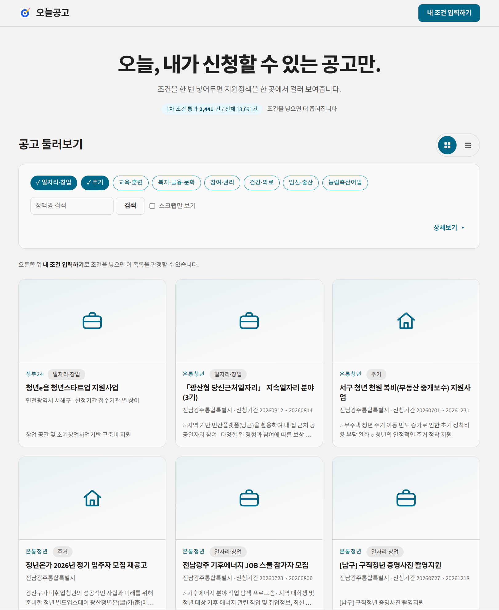

# 오늘공고

**오늘, 내가 신청할 수 있는 공고만.** 수도권(서울·인천·경기)에 사는 사람이 온통청년·정부24에 흩어진 지원정책 중 **자기가 실제로 신청할 수 있는 것**을 골라 볼 수 있게, 조건을 한 번 등록해두면 AI가 원문 근거와 함께 해당 여부를 판정합니다.

- **배포 주소** : https://gongoday.vercel.app



## 기술 스택

- **Frontend / Server** — Next.js 16 (App Router, Server Components), React 19, TypeScript, Tailwind CSS 4
- **DB / Auth** — Supabase (Postgres, RLS, 익명 로그인)
- **AI** — Gemini API (구조화 출력으로 판정)
- **외부 데이터** — 온통청년 청년정책 API, 정부24 공공서비스정보 API(odcloud)
- **배포 / 자동화** — Vercel, GitHub Actions(매시간 수집 트리거)

## 무엇을 하나

1. **목록** — 두 출처 13,662건을 한 테이블에 모아 최신순으로. 나이·지역은 등록한 조건으로, 분야는 칩을 켜고 꺼서 좁힙니다
2. **판정** — 현재 페이지 10건을 `해당 / 애매 / 아님`으로 판정합니다. **코드로 답이 나오는 조건은 AI를 부르지 않고**, 나머지만 Gemini가 판정합니다. 근거는 원문에서 그대로 인용한 문장이고 서버가 원문과 대조해 검증합니다
3. **상세** — 판정에 쓰인 원문을 그대로 보여주고 인용 구간을 하이라이트합니다. 스크랩할 수 있습니다

## 어떻게 동작하나

```
사용자 → 조건 입력(생년·시도/시군구·소득·상황 등)
       → 목록 열람 시 1차 SQL 필터(코드 조건 + 분야)로 후보 축소
       → 현재 페이지 10건만 자동 판정
           1단 코드 게이트: 나이·지역 등 코드로 대조 가능한 조건 → 불일치면 AI 호출 없이 '아님' 확정
           2단 AI 판정: 텍스트로만 표현된 조건만 Gemini에 위임 → 원문 인용 근거 포함
       → 서버가 인용문이 원문에 실제로 있는지 대조, 없으면 '애매'로 강등
       → 같은 조건 + 같은 정책 조합은 캐시 재사용(재호출 없음)
```

'아님' 판정도 목록에서 지우지 않고 배지만 붙여 남깁니다. 자세한 설계 근거는 [docs/PRD.md](docs/PRD.md) §7, [docs/ARCHITECTURE.md](docs/ARCHITECTURE.md)를 참고하세요.

## 실행

```bash
npm install
cp .env.example .env.local   # 키를 채운다 (각 키의 용도는 .env.example 주석 참고)
npm run dev
```

`supabase/schema.sql`이 스키마의 단일 진실 원천입니다. 정책 데이터는 **매시간 GitHub Actions**(`.github/workflows/sync.yml`)가 `POST /api/sync`를 쳐서 조회합니다 — 한 번에 10페이지씩 이어받으므로 온통청년은 3시간, 정부24는 11시간에 한 바퀴입니다. 즉시 돌려야 하면 `/admin`의 **갱신** 버튼을 씁니다.

## 문서

| 문서 | 내용 |
|---|---|
| [docs/PRD.md](docs/PRD.md) | 무엇을 왜 만드는가 · 기능 목록 · 리스크 |
| [docs/ARCHITECTURE.md](docs/ARCHITECTURE.md) | 데이터 모델 · 판정 흐름 · 예외 처리 매트릭스 |
| [docs/TODO.md](docs/TODO.md) | 작업 순서와 **각 작업의 완료 판정 결과** |

## 검증 스크립트

각 작업의 완료 판정을 실제로 돌려 확인합니다 (`npm run dev` 필요).

```bash
npx tsx scripts/verdict-check.mts       # 판정 순수 함수 60항목
npx tsx scripts/query-check.mts         # 목록 1차 필터 17항목
npx tsx scripts/profile-check.mts       # 프로필 저장·세션 격리 21항목
npx tsx scripts/verdict-api-check.mts   # 판정 API·캐시·배지 20항목
npx tsx scripts/detail-check.mts        # 인용 하이라이트 22항목
npx tsx scripts/release-check.mts       # 첫 방문자 흐름 + 예외 매트릭스 38항목
```
