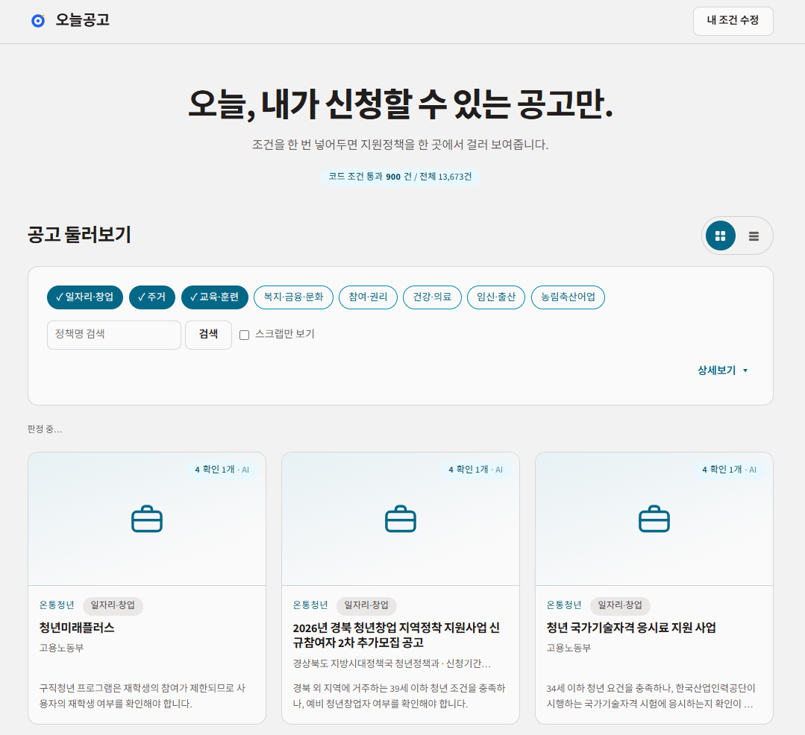

# 오늘공고

**오늘, 내가 신청할 수 있는 공고만.**

수도권(서울·인천·경기)에 사는 사람이 온통청년·정부24에 흩어진 지원정책을 한 곳에서 모아 볼 수 있도록 공고를 정리했습니다.

그리고 그 중 **사용자가 실제로 신청할 수 있는 것**을 볼 수 있도록, 조건을 한 번 등록해두면 AI가 원문 근거와 함께 해당 여부를 판정합니다.

- **배포 주소** : https://gongoday.vercel.app



## 기술 스택

- **Frontend / Server** — Next.js 16 (App Router, Server Components), React 19, TypeScript, Tailwind CSS 4
- **DB / Auth** — Supabase (Postgres, RLS, 익명 로그인)
- **AI** — OpenAI API (구조화 출력으로 판정)
- **외부 데이터** — 온통청년 청년정책 API, 정부24 공공서비스정보 API(odcloud)
- **배포 / 자동화** — Vercel, GitHub Actions(매시간 수집 트리거)

## 무엇을 하나

1. **목록** — 여러 공고를 한 테이블에 모아 최신순으로, 사용자가 등록한 조건으로 공고를 정리합니다.
2. **판정** — 현재 페이지 10건을 `해당 / 애매 / 아님`으로 판정합니다. **코드로 답이 나오는 조건은 AI를 부르지 않고**, 나머지만 AI가 판정합니다.
3. **상세** — 판정에 쓰인 원문을 그대로 보여주고 인용 구간을 하이라이트합니다.
4. **텔레그램 알림** — 로그인한 계정은 텔레그램을 연결하고 알림 받을 최소 점수(1~5)를 고를 수 있습니다. 매시간 수집 직후 새로 들어온 정책만 판정해, 고른 점수 이상이면 텔레그램으로 보내드립니다.

## 어떻게 동작하나

```
사용자 → 조건 입력(생년·시도/시군구·소득·상황 등)
       → 목록 열람 시 1차 SQL 필터(코드 조건 + 분야)로 후보 축소
       → 현재 페이지 10건만 자동 판정
           1단 코드 게이트: 나이·지역 등 코드로 대조 가능한 조건 → 불일치면 AI 호출 없이 '아님' 확정
           2단 AI 판정: 텍스트로만 표현된 조건만 AI에 위임 → 원문 인용 근거 포함
       → 서버가 인용문이 원문에 실제로 있는지 대조, 없으면 '애매'로 강등
       → 같은 조건 + 같은 정책 조합은 캐시 재사용(재호출 없음)
```

텔레그램은 `/profile`에서 딥링크로 연결하고, 매시간 크론이 수집 다음 단계로 새 정책만 판정해 고른 점수 이상인 것만 보냅니다. 자세한 설계 근거는 [docs/ARCHITECTURE.md](docs/ARCHITECTURE.md) §11을 참고하세요.

## 실행

```bash
npm install
cp .env.example .env.local   # 키를 채운다 (각 키의 용도는 .env.example 주석 참고)
npm run dev
```

`supabase/schema.sql`이 스키마의 단일 진실 원천입니다. 정책 데이터는 **매시간 GitHub Actions**(`.github/workflows/sync.yml`)가 `POST /api/sync`를 쳐서 조회합니다. 같은 워크플로가 이어서 `POST /api/notify`를 쳐서 텔레그램 알림 배치를 돌립니다. 텔레그램 봇을 쓰려면 `.env.local`에 `TELEGRAM_*` 값을 채운 뒤 `node scripts/telegram-set-webhook.mjs`로 웹훅을 한 번 등록해야 합니다.

## 문서

| 문서 | 내용 |
|---|---|
| [docs/ARCHITECTURE.md](docs/ARCHITECTURE.md) | 데이터 모델 · 판정 흐름 · 예외 처리 매트릭스 |
| [docs/MEASUREMENTS.md](docs/MEASUREMENTS.md) | **설계 결정마다 재본 수치** · 모델 비교 · 표본에서 깨진 가정 |

## 검증 스크립트

각 기능의 검증 항목을 실제로 돌려 확인합니다 (`npm run dev` 필요).

```bash
npx tsx scripts/verdict-check.mts       # 판정 순수 함수 68항목
npx tsx scripts/query-check.mts         # 목록 1차 필터 17항목
npx tsx scripts/profile-check.mts       # 프로필 저장·세션 격리 21항목
npx tsx scripts/verdict-api-check.mts   # 판정 API·캐시·배지 20항목
npx tsx scripts/detail-check.mts        # 인용 하이라이트 22항목
npx tsx scripts/release-check.mts       # 첫 방문자 흐름 + 예외 매트릭스 38항목
```

## AI 판정의 신뢰성 설계

LLM을 붙이는 것보다 **틀린 답이 사용자에게 닿지 않게 만드는 것**에 시간을 썼습니다. 모든 수치는 `scripts/`의 실측 결과이고 근거는 [docs/MEASUREMENTS.md](docs/MEASUREMENTS.md)에 남아 있습니다.

| 문제 | 대응 | 실측 |
|---|---|---|
| 환각 (없는 근거를 지어냄) | 모델이 낸 `quote`를 서버가 원문과 문자 단위로 대조하고, 불일치하면 `애매`로 강등 | 모델 비교에서 gemini-2.5 계열은 인용 일치 86.7~90%, 3.x·gpt-5.4-mini는 100% |
| "모른다"와 "아니다"의 혼동 | 시스템 프롬프트 규칙 6: 사용자가 고른 항목이 전부가 아니면 `아님`으로 단정하지 않음 | 규칙 보강 후 모델 간 판정 불일치 33% → 23.3%, 최종 모델은 경계 케이스 20회 반복 재현 |
| 비용 | 나이·지역 등 코드로 답이 나오는 조건은 AI를 부르지 않고 확정 | 전체 13,662건 중 AI까지 가는 건 1,781건(13.0%) |
| 중복 호출 | 캐시 키를 (정책, 프로필 서명, 프롬프트 지문)으로 구성. 사용자별이 아니라 조건별 | 전환 시점 142행 중 87건(61%)이 중복 호출이었음 |
| 캐시가 옛 답을 새 답인 척함 | 서명을 모델에 실제로 넘긴 문자열에서 계산하고, 프롬프트가 바뀌면 지문도 바뀌어 자동 재판정 | 해가 바뀌어 나이가 달라지는 경우까지 재판정됨 |
| 코드 게이트의 오탈락 | 가구상황은 게이트에서 제외 (반대 사실 55건 중 43건이 `무주택세대`) | 잔여 오판 위험 상한 3.8%, 폼 안내로 회수 |
| 프롬프트 인젝션 | 원문은 데이터로만 취급하도록 규칙 명시 | — |
| 외부 API 장애 | OpenAI 호출은 throw하지 않고 모든 실패를 `unclear`로 흡수. 실패한 호출의 토큰도 집계 | 어떤 실패도 화면을 비우지 않음 |
| 운영 | 배치별 호출 수, 캐시 적중, 토큰을 `verdict_runs`에 기록. 관리자가 AI 판정을 끄고 켤 수 있음 | 90일 지난 운영 로그는 배치로 정리 |
